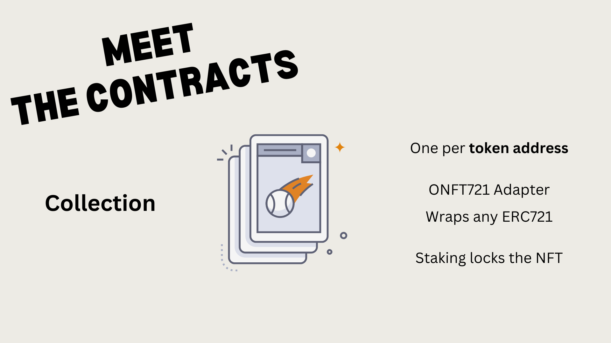

# Stake of the Art (SOTA)

Default NFT contract deployed to Polygon Amoy
0xA9215c559ea256508D61e37A543ED79A5b287CEb
https://amoy.polygonscan.com/address/0x9e1f2c3432ddce2aae0f605f38e3234ee6fbc91a

Deployed NFT Collection ONFTAdapter on Amoy
0x73D915D9a64318714ca1D97f65475387240C06AF

Official Schema
{
  schemaId: '0xa9',
  txHash: '0x9d291652245b812a74972453ba3b26e12d409e2470018e2331ccbc55b771b058'
}

## Overview

Hello! This is **Stake of the Art**.
It is an ecosystem where artists can stake their artwork and earn royalties for every time someone uses it.

| | |
| --- | --- |
|  |  |

---

The partner technologies we found most helpful to building our project are:
- [**XMTP**](#xmtp)
- [**Filecoin**](#filecoin)
- [**World Coin**](#world-coin)
- [**Layer Zero**](#layer-zero)
- [**Sign Protocol**](#sign-protocol)

_These links go directly to the partner technology breakdown_

---

## Partner Technology breakdown

### XMTP
### Filecoin
### World Coin
### Layer Zero
Layer Zero gives us the power to integrate NFTS from every single chain they support.
This is a huge advantage artists are not tied to the one single chain where they had deployed the NFT's for their artwork.
The more artists we can include in the ecosystem the stronger we become.

|  |  |
| --- | --- |
|  |  | 
|  |  |

Now that you've met the contracts and know what they're about, let's see how they work together.

**Staking**

For an artist, this is their first entry point into our ecosystem.

They first approve the Collection contract to make a transfer of their NFT to itself.
Then they call the `stake` function to lock their NFT.

Layer Zero has an `ONFT721Adapter` that wraps around any nft contract so our ecosystem can support any NFT Contract are the artist may find their artwork deployed to.

Now when the artist stakes their NFT it is not sufficient enough for us to simply trust that these NFTs belong to them. We need to verify that they are the rightful beneficiaries of the artworks royalties.

We can validate this by requiring proof royalty rights in the form of a Sign Protocol attestation. The attestation is a digital representation defining who has the right to claim royalties on the artwork.

This is interesting because it gives the artist the ability to directly transfer these rights to someone else. This is a powerful feature because it allows the artist to sell their artwork and the royalties that come with it.

Finally, when these two conditions are met they are able to enrol into the gallery and start earning royalties.
The gallery itself is an `ONFT721` contract which is a normal ERC721 contract with Cross-Chain messaging. This means we can utilise its mint function to create an NFT representing the enrollment.

The gallery then keeps a record of these minted NFTs for any users of the ecosystem apps to query and pay for.

> As a nice extra feature, We have created a default ERC721 contract to support artists who have artwork but have not yet deployed it to a chain. This allows them to quickly stake their artwork and start earning royalties without having to deploy it to a chain.

**Unstaking**

When the artist wants to unstake their NFT they call the `unstake` function on the Collection contract.

Just like the staking function, it triggers a message to the gallery contract. However, in this case, we are burning the gallery NFT since the artist is no longer eligible for royalties.

**Revoking**

If the artist wants to revoke the rights to their royalties they can call the `revoke` function on the Collection contract.

This will also trigger a message with the gallery contract to burn the NFT representing the enrollment.

**Claiming**

When a user wants to claim the royalties they have earned they call the `claim` function on the Curator contract.

The curator contract will then signal the cashier contract to make a payment to the user.

We didn't have time to implement this feature more fully. however the ability to send native tokens from one chain to another gives the artist the chance to receive royalties in their native currency.

#### Implementation

To show you that the contracts are live and working on the blockchain, here are the links to their deployment.

Amoy ERC721 Contract
0x9e1F2c3432ddCe2AAe0f605f38e3234EE6fbC91a

Gallery on WorldCoin TestNet
0xE3F18EC91F05FC2824B4C648C40B0d79633eaCa6

Gallery on Sepolia
0x5104351d5bd4A5EFBa9083Ef12A72e918105Dc9d

Curator on Amoy
0x00fa2599575A78687C1148EB5C74EC35Bd05dc4c

Amoy ERC721 Contract
0x9e1F2c3432ddCe2AAe0f605f38e3234EE6fbC91a

Collection on Amoy wrapping ERC721
0x2b3Ae68fbe02a557a43BCfFB85392c925c00F261

Wired up

Collection sends message to Gallery on minting and burning
Send Transaction: 0x2fd434701208f9f7552bc53db86a6e73a83099bbda463123400198b488740974

---

### Sign Protocol

#### Schema Hooks
- **Schema Hooks**
  - Release subscription payments to content creators
  - Safely manage subscriber's payments.
